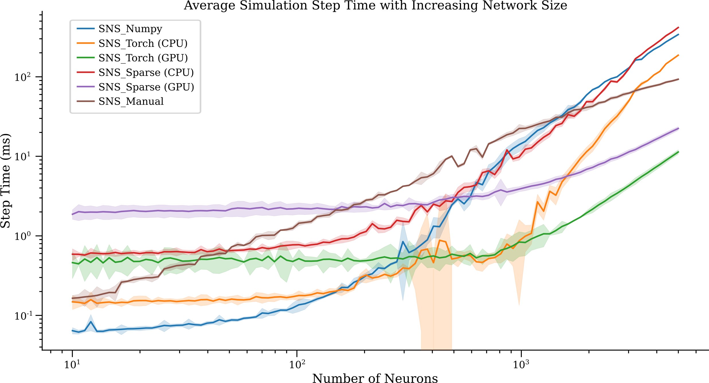

Compiling and Simulating Networks
"""""""""""""""""""

SNS-Toolbox is designed with two goals: designing networks with a simple scripting system, and simulating these networks
in an efficient manner. In `Building Networks <https://sns-toolbox.readthedocs.io/en/latest/networks.html>`_
we covered the different options available when designing a network, here we will walk through the backend interface and
how to simulate SNS networks using SNS-Toolbox.

General Interface and Process:
==============================

When simulating a network, we start with a
:code:`Network` object:
::
    net = Network('Name of network')
This network object is not capable of being simulated in its current state, it is just a container containing a
description of the various components within a network. In order to simulate this network, we need to compile it to a
simulation backend:
::
    model = net.compile(dt=0.01, backend='numpy', device='cpu', debug=False)

where :code:`dt` is the simulation timestep in ms, :code:`backend` takes a string representing any of the backends
included within SNS-Toolbox, :code:`device` is the hardware the network will run on (:code:`'cpu'` for the processor,
:code:`'cuda'` for the GPU), and :code:`debug` causes various debugging information to be printed to the console if set
to true.

Simulating a Network:
=====================

Now that a model is built, the model can be called timestep by timestep to simulate the network dynamics as follows:
::
    for i in range(num_steps):
        data = model(x)

where :code:`x` is a vector of external inputs which is applied at each step. If there are no external inputs present in
the network, it can be run as:
::
    for i in range(num_steps):
        data = model()

Backend Statistics:
===================

All of the simulation backends within SNS-Toolbox implement the same neural dynamics, just using different software
strategies. Detailed descriptions of each backend option are presented in the following sections, for performance on a
certain network topology please see the following performance chart:

Based on experimentation, here are some general recommendations for networks with a roughly 1:1 comparison between the
number of neurons and synapses:

- for small networks (under ~300), :code:`SNS_Numpy` and :code:`SNS_Torch` (CPU version) will execute the fastest.
- Networks with 300-7000 neurons will execute the fastest using :code:`SNS_Torch` and a CUDA-compatible GPU.
- Networks with 7000-11000 neurons will execute the fastest using :code:`SNS_Sparse` and a CUDA-compatible GPU.
- For networks with over 11000 neurons, due to memory constraints the simple iterative :code:`SNS_Manual` backend is the best option.

Additionally, due to constraints with memory access and architecture, each of these backends has a maximum possible
network size before the host system runs out of memory. These examples are given below:

.. csv-table:: Experimental Maximum Network Size
    :file: max_net_size.csv
    :header-rows: 1

If you run a simulation and find conflicting empirical performance data, please email the `project maintainer <nourse@case.edu>`_ and our
documentation may be updated.

SNS_Numpy:
==========

:code:`SNS_Numpy` simulates networks using the `numpy <https://numpy.org/>`_ python package. All parameters are
stored in :code:`np.ndarray` objects. Build this backend with the following command:
::
    model = net.compile(backend='numpy')

Note that :code:`SNS_Numpy` only supports execution on the CPU.

SNS_Torch:
==========

:code:`SNS_Torch` simulates using `PyTorch <https://pytorch.org/>`_. All parameters are stored in :code:`torch.Tensor`
objects. :code:`SNS_Torch` networks can be simulated on either the CPU or a CUDA-enabled GPU. To simulate on the CPU,
build the network as
::
    model = net.compile(backend='torch', device='cpu')
For GPU simulation, use
::
    model = net.compile(backend='torch', device='cuda')
or for machines with multiple GPUs
::
    model = SNS_Torch(net, device='cuda:i')
where :code:`i` is the index of the desired GPU.

SNS_Sparse:
===========

:code:`SNS_Sparse` simulates using `PyTorch Sparse <https://pytorch.org/docs/stable/sparse.html>`_.
All parameters are specified as :code:`torch.Tensor` objects, then stored in :code:`torch.sparse_coo_tensor` objects.
:code:`SNS_Sparse` networks can be simulated on either the CPU or a CUDA-enabled GPU. To simulate on the CPU,
build the network as
::
    model = net.compile(backend='sparse', device='cpu')
For GPU simulation, use
::
    model = net.compile(backend='sparse', device='cuda')
or for machines with multiple GPUs
::
    model = net.compile(backend='sparse', device='cuda:i')
where :code:`i` is the index of the desired GPU.

Due to the process of building sparse tensors and matrices, :code:`SNS_Sparse` networks take longer to compile than the
other backends. For improved performance, loading of a pre-built network may improve performance. See
`Saving and Loading Networks <https://sns-toolbox.readthedocs.io/en/latest/saving_loading.html>`_
for more information.

SNS_Iterative:
===========

The :code:`SNS_Iterative` backend implements the same neural dynamics as the other backends, but does so using iterative
operations instead of vectors and matrices. Its primary purpose is as a benchmarking comparison for the vector-based
algorithms, however can be useful for extremely large and sparse networks which exceed the memory constraints of other
backends.

All parameters are stored in :code:`np.ndarray` objects. This backend can be built with the following command:
::
    model = net.compile(backend='iterative')

Note that :code:`SNS_Iterative` only supports execution on the CPU.