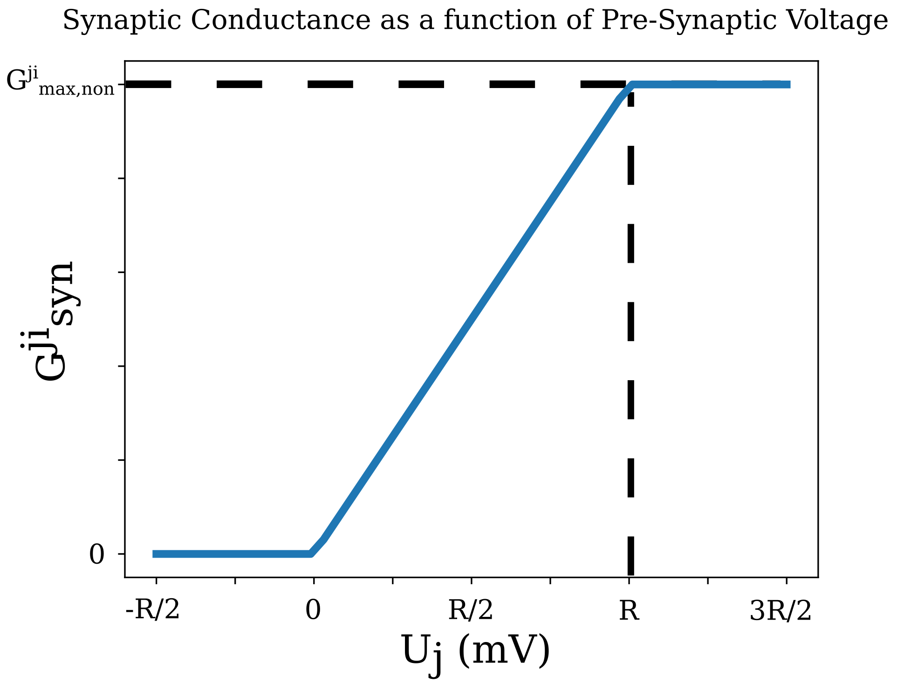
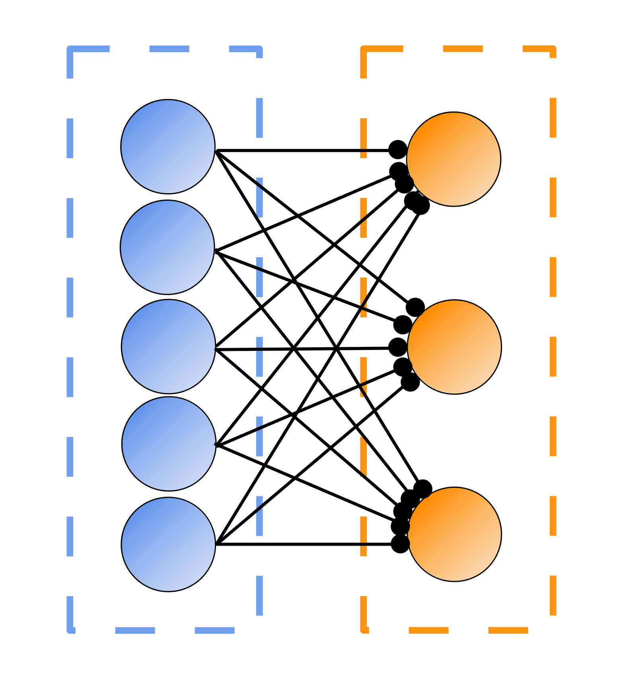

"""""""""""""""""
Connection Models
"""""""""""""""""

Neurons, and populations of neurons, are connected in SNS-Toolbox using *connections*. The different versions available
are as follows:

=============================
Non-Spiking Chemical Synapse:
=============================

The most basic form of synaptic connection. The amount of synaptic current :math:`I_{syn}^{ji}` from pre-synaptic neuron
:math:`j` to post-synaptic neuron :math:`i` is

.. math::
    I_{syn}^{ji} = G_{syn}^{ji}(V_j) \cdot \left ( E_{syn}^{ji} - V_i \right ),

where :math:`E_{syn}^{ji}` is the reversal potential of the synapse, and :math:`G_{syn}^{ji}(V_j)` is
the synaptic conductance as a function of the pre-synaptic neural voltage:

.. math::
    G_{syn}^{ji}(V_j) = max \left ( 0, min \left ( G_{max,non}^{ji} \cdot \frac{V_j - E_{lo}}{E_{hi} - E_{lo}}, G_{max,non}^{ji} \right ) \right )

:math:`G_{max,non}^{ji}` is the maximum synaptic conductance, :math:`E_{lo}` is the synaptic activation voltage, and
:math:`E_{hi}` is the synaptic saturation voltage.

Default values are as follows:

- :math:`G_{max,non}^{ji} = 1 \mu S`
- :math:`E_{syn}^{ji} = 40mV`
- :math:`E_{lo} = 0mV`
- :math:`E_{hi} = 20mV`

This form of synapse can be implemented using
`sns_toolbox.design.connections.NonSpikingSynapse <https://sns-toolbox.readthedocs.io/en/latest/autoapi/sns_toolbox/design/connections/index.html#sns_toolbox.design.connections.NonSpikingSynapse>`_.

=========================
Spiking Chemical Synapse:
=========================

Spiking synapses produce a synaptic current similar in formulation to non-spiking chemical synapses,

.. math::
    I_{syn}^{ji} = G_{syn}^{ji} \cdot \left ( E_{syn}^{ji} - V_i \right ),

however they differ in that :math:`G_{syn}^{ji}` is a dynamical variable. This conductance is reset to a maximum value
of :math:`G_{max,spike}^{ji}` whenever the pre-synaptic neuron spikes, and otherwise decays to 0 with a time constant of
:math:`\tau_{syn}^{ji}`.

.. math::
    \tau_{syn}^{ji}\frac{dG_{syn}^{ji}}{dt} = -G_{syn}^{ji}

    \text{if \delta = 1, G_{max,spike}^{ji}\leftarrow G_{syn}^{ji}}

If desired, synaptic propagation delay can also be incorporated. If the synapse from neuron :math:`j` to :math:`i` has a
delay of :math:`d` timesteps, the delayed spike can be defined as:

.. math::
    \delta_{delay}^{ji}[t] = \delta^{ji}[t - d\cdot\Delta t].

Default values are as follows:

- :math:`G_{max,spike} = 1 \mu S`
- :math:`E_{syn}^{ji} = 194 mV`
- :math:`\tau_{syn}^{ji} = 1 ms`
- :math:`d = 0`

This form of synapse can be implemented using
`sns_toolbox.design.connections.SpikingSynapse <https://sns-toolbox.readthedocs.io/en/latest/autoapi/sns_toolbox/design/connections/index.html#sns_toolbox.design.connections.SpikingSynapse>`_.

====================
Electrical Synapse:
====================

Electrical synapses (also known as gap junctions) are a form of synaptic connection which communicates using direct
current transmission instead of synaptic neurotransmitters. Their generated synaptic current is:

.. math::
    I_{syn}^{ji} = G_{syn,electrical} \cdot \left ( V_j - V_i \right ),

where :math:`G_{syn,electrical}` is the synaptic conductance. By default electrical synapses are bidirectional, meaning
current can flow in either direction between :math:`U_j` and :math:`U_i`. However electrical synapses can also be
rectified if desired, meaning that current only flows from :math:`U_j` to :math:`U_i`, and only if :math:`U_j>U_i`.

This form of synapse can be implemented using
`sns_toolbox.design.connections.ElectricalSynapse <https://sns-toolbox.readthedocs.io/en/latest/autoapi/sns_toolbox/design/connections/index.html#sns_toolbox.design.connections.ElectricalSynapse>`_.

====================
Pattern Connection:
====================

Chemical synapses can also be defined which connect populations of neurons, instead of single neurons.

All of the synaptic dynamics are unchanged between a non-spiking or spiking synapse and a non-spiking or spiking pattern
connection, the only difference is that these parameters are now vectors/matrices representing the kernel which is tiled
to describe the synaptic pattern. *Note that there is currently no pattern implementation for electrical synapses*.

These forms of synapse can be implemented using
`sns_toolbox.design.connections.NonSpikingPatternConnection <https://sns-toolbox.readthedocs.io/en/latest/autoapi/sns_toolbox/design/connections/index.html#sns_toolbox.design.connections.NonSpikingPatternConnection>`_
and
`sns_toolbox.design.connections.SpikingPatternConnection <https://sns-toolbox.readthedocs.io/en/latest/autoapi/sns_toolbox/design/connections/index.html#sns_toolbox.design.connections.SpikingPatternConnection>`_.

For more information, see
`Tutorial 6: Connectivity Patterns <https://sns-toolbox.readthedocs.io/en/latest/tutorials/tutorial_6.html#Tutorial-6:-Using-Connectivity-Patterns>`_.