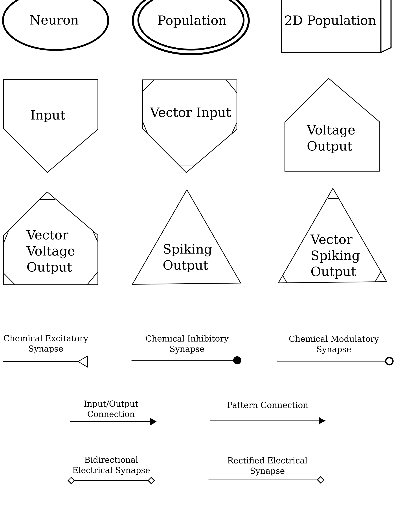

""""""""""""""""""
Rendering Networks
""""""""""""""""""

When designing networks, it can be useful to have a visual representation of network structure. SNS-Toolbox provides an
interface for rendering images of SNS network structures, which is built using :code:`graphviz`. Installing
:code:`graphviz` is not necessary for designing and simulating networks with SNS-Toolbox, but is required for rendering
their structure. For installing :code:`graphviz` in your development environment, please consult their
`documentation <https://graphviz.readthedocs.io/en/stable/manual.html>`_.

============
Basic Usage:
============

For a basic overview of how to use the rendering engine, let's build a simple network.

.. code::
    neuron_type = NonSpikingNeuron()
    synapse_excitatory = NonSpikingSynapse(reversal_potential=40.0)
    synapse_inhibitory = NonSpikingSynapse(max_conductance=1.0, reversal_potential=-40.0)
    synapse_modulatory = NonSpikingSynapse(reversal_potential=0.0)

    net = Network(name='Network')
    net.add_neuron(neuron_type,name='0',color='cornflowerblue')
    net.add_neuron(neuron_type,name='1',color='darkorange')
    net.add_neuron(neuron_type,name='2',color='firebrick')

    net.add_connection(synapse_excitatory,'0','1')
    net.add_connection(synapse_excitatory,'0','2')
    net.add_connection(synapse_modulatory,'1','1')
    net.add_connection(synapse_inhibitory,'2','0')

    net.add_input('0',name='Iapp')
    net.add_output('0',name='O0')
    net.add_output('1',name='O1')
    net.add_output('2',name='O2')

Once a network is built, we can pass it into the SNS-Toolbox renderer:

.. code::
    from sns_toolbox.renderer import render

    render(net, view=True, save=True, filename='Example Network', img_format='png')

and the above network is rendered into a connectivity graph.

.. image:: images/DocsExample.png
    :width: 400

==================
Supported Formats:
==================

:code:`graphviz` supports a wide variety of image formats, please see their
`documentation <https://graphviz.org/docs/outputs/>`_.

================
Symbol Glossary:
================

=================
Available Colors:
=================

.. image:: images/color_options.png
    :width: 800